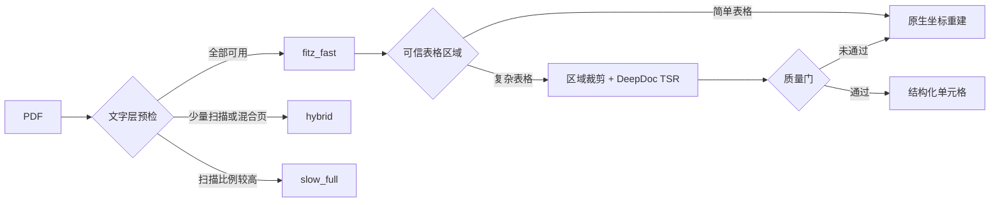

<p align="center">
  
</p>

<h1 align="center">DeepDoc</h1>

<p align="center">
  <strong>面向 RAG 的文档解析与结构化提取工具</strong><br>
  简单文档保持快速，复杂结构按需识别。
</p>

<p align="center">
  <a href="https://www.python.org/"></a>
  <a href="LICENSE"></a>
  <a href="requirements.txt"></a>
  <a href="requirements.txt"></a>
  <a href="#pdf-分层解析与复杂表格"></a>
</p>

<p align="center">
  <a href="#主要功能">主要功能</a> ·
  <a href="#快速开始">快速开始</a> ·
  <a href="#pdf-分层解析与复杂表格">PDF 路由</a> ·
  <a href="#配置">配置</a> ·
  <a href="#常见问题">常见问题</a>
</p>

DeepDoc 支持 PDF、Word、Excel、PowerPoint、HTML、Markdown、JSON 和 TXT，统一处理原生文字、OCR、版面与表格结构。当前 PDF 路径强调一条原则：**默认走快路径，只有真正复杂的局部区域才调用模型。**

## 核心设计

| 快速优先 | 结构保真 | 安全回退 |
| --- | --- | --- |
| 可编辑 PDF 直接读取原生文字层，避免不必要的整页 OCR | 表格文字来自原生 PDF，TSR 只辅助恢复行列与跨列关系 | 结构结果未通过质量门时自动退回坐标重建 |

## 主要功能

### 多格式文档解析

支持 8 种主流文档格式：

- **PDF**：OCR 文字识别、版面布局识别、表格提取、图表分析
- **Word (DOCX)**：段落、表格、样式提取
- **Excel/CSV**：智能表格解析、编码检测
- **PowerPoint (PPTX)**：幻灯片文本、表格提取
- **HTML**：主体内容提取（去除样式）
- **Markdown**：表格和结构提取
- **JSON**：智能分块（避免超大 JSON）
- **TXT**：分隔符智能分段

### 高级 PDF 处理能力

- **版面布局识别**：识别标题、正文、图片、表格、页眉页脚等 11 种版面元素（基于 YOLOv10）
- **OCR 文字识别**：支持 CPU 和 GPU (CUDA) 推理，基于 ONNX 模型优化
- **分层解析路由**：可编辑 PDF 优先使用 PyMuPDF 原生文字层，扫描页才进入 OCR 路径
- **选择性表格结构识别**：简单表格快速重建；只有复杂表格裁剪区域才调用 DeepDoc TSR
- **质量回退**：模型输出未通过行列、覆盖率、置信度和文字保留率检查时，自动回退快速路径
- **视觉语言模型集成**：支持 VLM 图像理解，生成 Markdown 格式文档
- **段落智能合并**：使用 XGBoost 模型预测段落合并
- **异步并发处理**：使用 `trio` 库实现多页 OCR 并发

### RAG 优化特性

- **智能分块（Chunking）**：基于 Token 数量的智能分段
- **多语言编码支持**：支持 40+ 种字符编码自动检测
- **表格内容语义化**：将表格转为文本描述，便于向量化和检索

## 安装

### 基础安装

```bash
# 克隆仓库
git clone https://github.com/skygazer42/deepdoc.git
cd deepdoc

# 安装依赖
pip install -r requirements.txt
```

### 可选依赖

如果需要 GPU 加速，请安装支持 CUDA 的 PyTorch：

```bash
# CUDA 11.8
pip install torch --index-url https://download.pytorch.org/whl/cu118

# CUDA 12.1
pip install torch --index-url https://download.pytorch.org/whl/cu121
```

### NLTK 数据下载

首次使用需要下载 NLTK 数据：

```python
import nltk
nltk.download('punkt')
nltk.download('wordnet')
```

### 词典文件

分词器需要词典文件。首次运行时，程序会尝试从 HuggingFace 自动下载模型文件。

如果需要自定义词典，请将词典文件放置在：
```
resources/data_parser/qieci.txt
```

词典格式：每行包含 `词汇 频率 词性`，用空格或制表符分隔。

## 快速开始

### PDF 解析（推荐入口）

`parse_pdf_document()` 会先预检页面，再自动选择快速提取、混合 OCR 或完整 OCR 路径。直接调用该函数不需要启动 HTTP 服务，也不会占用端口。

```python
from parser.fast_pdf import ModelConfig, parse_pdf_document

config = ModelConfig.from_env()
config.ocr_depth = "skip"  # 不允许扫描页调用 OCR；可编辑 PDF 不受影响

document = parse_pdf_document(
    "document.pdf",
    cfg=config,
    need_image=False,
)

print(document.engine)
print(document.stats)
for chunk in document.chunks:
    print(chunk.kind, chunk.clean_text, chunk.meta)
```

返回值是统一的 `ParseDocument`：正文、表格和图片分别使用 `text`、`table`、`figure` 类型的 `ParseChunk`，并保留页码与坐标标签。

### 传统 PDF 完整解析器

```python
from deepdoc.parser import PdfParser

# 创建 PDF 解析器
parser = PdfParser()

# 解析 PDF 文件
chunks = parser("document.pdf", need_image=True)

# 遍历结果
for chunk in chunks:
    print(chunk)
```

### Word 文档解析

```python
from deepdoc.parser import DocxParser

# 创建 DOCX 解析器
docx_parser = DocxParser()

# 解析 Word 文档
sections = docx_parser("document.docx")

# 输出内容
for section in sections:
    print(section)
```

### Excel 解析

```python
from deepdoc.parser import ExcelParser

# 创建 Excel 解析器
excel_parser = ExcelParser()

# 解析 Excel 文件
data = excel_parser("data.xlsx")

# 处理数据
for row in data:
    print(row)
```

### 其他格式

```python
from deepdoc.parser import (
    PptParser,      # PowerPoint
    HtmlParser,     # HTML
    MarkdownParser, # Markdown
    JsonParser,     # JSON
    TxtParser       # 文本
)

# 使用方式类似
ppt_parser = PptParser()
result = ppt_parser("presentation.pptx")
```

## PDF 分层解析与复杂表格

### 相对本分支改造前的变化

| 改造前 | 当前实现 | 实际收益 |
| --- | --- | --- |
| 文本 PDF 遇到表格线条可能切换整篇慢路径 | 文本页始终保留原生快速提取，只对复杂表格裁剪区域调用 TSR | 避免重复渲染和整页模型推理 |
| 仅按页面图元数量判断表格 | 综合线框、文字占用率、区域尺寸和真实横线确定表格区域 | 折线图、坐标轴和网络结构图不再轻易误判成表格 |
| 完整管线对已有文字层的页面仍可能执行 OCR | 原生文字直接进入 Layout，仅对缺失文字层的页面 OCR | 降低可编辑 PDF 的 OCR 时间和文字误差 |
| 表格文字主要按视觉行横向拼接 | 复杂表格输出逻辑行列、单元格、跨列关系和 HTML | 更适合 RAG 分块、检索和后续结构化处理 |
| 模型结果直接进入输出 | 增加覆盖率、置信度和文字保留率质量门 | 模型不可靠时自动回退，不牺牲已有快速结果 |

### 页面路由

统一入口位于 `parser/fast_pdf.py`，根据文字层和扫描页比例选择路径：

| 路径 | 适用文档 | 实际处理 |
| --- | --- | --- |
| `fitz_fast` | 全部页面都有可用文字层 | PyMuPDF 原生提取；表格在原位置重建 |
| `hybrid` | 少量扫描页或混合页 | 文字页走 PyMuPDF，仅扫描页走 PP-StructureV3 |
| `slow_full` | 扫描页或混合页的比例、页数超过局部处理阈值 | 对有效页面执行 PP-StructureV3 OCR 与版面分析 |



这套路由不会因为文档中出现一个表格，就重新渲染并识别整篇 PDF。

### 表格处理顺序

1. 使用线框、文字占用率和区域尺寸寻找可信表格，过滤折线图、坐标轴和网络结构图。
2. 简单表格直接根据原生 PDF 坐标重建，避免模型开销。
3. 默认仅当表格同时满足以下条件时，裁剪该区域并调用 DeepDoc TSR：
   - 原生文字 span 数不少于 `80`；
   - 表格宽度不少于页面宽度的 `45%`；
   - 至少包含 `5` 个视觉行。
4. TSR 预测行列边界，解析器再重建单元格与跨列关系；文字仍来自原生 PDF，不重复 OCR。
5. 结构结果必须通过行列范围、轴覆盖率、模型置信度和至少 `90%` 的文字保留率检查，否则自动回退快速重建。

单页默认最多处理 `2` 个复杂表格区域。模型采用线程安全的懒加载：普通页面和简单表格不会初始化 TSR；第一次复杂表格请求加载后，该进程内后续请求复用同一个 ONNX Session。

结构化表格行会携带以下 `meta` 字段：

| 字段 | 说明 |
| --- | --- |
| `engine` | `deepdoc_tsr` 表示通过选择性 TSR；`fitz_table_lines` 表示快速重建 |
| `rows` / `columns` | 模型接受后的逻辑行列数 |
| `cells` | 当前行按列拆分后的原生文字 |
| `colspans` | 当前行的跨列信息，`0` 表示被前一个跨列单元格覆盖 |
| `html` | 完整表格 HTML，仅附在首行，避免每行重复 |
| `text_retention` | 结构映射后的原生文字保留率 |
| `inference_ms` | 该裁剪区域的模型推理时间 |

<details>
<summary><strong>查看 ResNet 第 5 页的结构化输出示例</strong></summary>

```text
layer name | output size | 18-layer | 34-layer | 50-layer | 101-layer | 152-layer
conv1 | 112×112 | 7×7, 64, stride 2
conv2_x | 56×56 | [3×3, 64 / 3×3, 64]×2 | [3×3, 64 / 3×3, 64]×3 | ...
FLOPs | | 1.8×10^9 | 3.6×10^9 | 3.8×10^9 | 7.6×10^9 | 11.3×10^9
```

该页的大型网络结构表进入 TSR；下方小结果表仍使用快速坐标重建，两张训练曲线不会被当成表格。

</details>

### 选择性表格配置

| 环境变量 | 默认值 | 作用 |
| --- | --- | --- |
| `SELECTIVE_TABLE_ENGINE` | `deepdoc` | `deepdoc` 按需启用；`off` 完全关闭选择性 TSR |
| `SELECTIVE_TABLE_MIN_SPANS` | `80` | 复杂表格的最小原生 span 数 |
| `SELECTIVE_TABLE_MAX_REGIONS` | `2` | 单页最多调用 TSR 的区域数 |
| `SELECTIVE_TABLE_SCALE` | `2` | 表格裁剪渲染倍数，`2` 对应约 144 DPI |
| `MIN_TEXT_CHARS_PER_PAGE` | `20` | 判断页面是否具有可用文字层 |
| `MAX_OCR_PAGES_PARTIAL` | `4` | 混合路径允许的最多 OCR 页数 |
| `MAX_MIXED_RATIO` | `0.35` | 混合页比例超过该值时切换完整慢路径 |
| `OCR_DEPTH` | `full` | `full`、`fast` 或 `skip` |

如果部署内存紧张，关闭选择性 TSR：

```bash
export SELECTIVE_TABLE_ENGINE=off
```

`TABLE_ENGINE=slanet` 只影响传统完整解析管线，不改变上述选择性 DeepDoc TSR 路径。

### 已验证的性能边界

以下数据来自仓库内 `regression/documents/resnet.pdf`（12 页）在当前 CPU 环境的单进程实测，只用于说明冷启动与选择性调用的差异，不作为其他机器的 SLA：

| 场景 | 全文耗时 |
| --- | ---: |
| 关闭选择性 TSR，仅快速路径 | 约 7.42 秒 |
| 选择性 TSR，首次 API 请求 | 约 9.12 秒 |
| 选择性 TSR，模型已加载 | 约 7.44 秒 |

- 单个复杂表格裁剪的 TSR 推理约为 `0.09–0.25` 秒。
- 首次模型初始化约为 `1.61` 秒，只在第一次遇到复杂表格时发生。
- 当前环境中，基础解析进程约占 `517 MB`；首次 TSR 推理后约占 `945 MB`，增量约为 `430 MB`。
- 每个多进程 Worker 都有独立模型缓存。内存限制较小时，应减少 Worker 数、关闭选择性 TSR，或将 TSR 隔离到独立服务。

### HTTP 服务（可选）

仓库不会自动启动服务。端口由 `PORT` 控制，下面示例使用 `18080`，无需占用默认的 `8000`：

```bash
HOST=127.0.0.1 PORT=18080 python api_service.py
```

调用解析接口：

```bash
curl -F file=@document.pdf \
  -F use_ocr=false \
  -F max_chunks=2000 \
  http://127.0.0.1:18080/parse
```

`use_ocr=false` 表示扫描页不允许调用 OCR，不会关闭可编辑 PDF 的原生文字提取或选择性表格 TSR。

## 配置

项目配置文件位于 `configs/settings.py`，主要配置项包括：

```python
# 模型存储路径（默认：仓库内 resources/models）
MODEL_BASE_DIR = "resources/models"

# OCR 检测阈值（默认：0.3）
OCR_DET_THRESHOLD = 0.3

# PDF DPI 设置（默认：200）
PDF_DPI = 200

# Hugging Face 镜像站点（可选）
HF_ENDPOINT = "https://huggingface.co"
```

可以通过环境变量覆盖配置：

```bash
export OCR_DET_THRESHOLD=0.5
export PDF_DPI=300
export HF_ENDPOINT="https://hf-mirror.com"
```

## 项目结构

```
deepdoc/
├── api_service.py                 # 可选 FastAPI 服务
├── parser/                        # 文档解析器模块
│   ├── fast_pdf.py                # PDF 预检、分层路由与统一结果模型
│   ├── pdf_parser.py              # OCR、Layout 与传统 PDF 管线
│   ├── docx_parser.py             # Word 解析器
│   ├── excel_parser.py            # Excel 解析器
│   └── ...
├── vision/                        # 视觉识别模块
│   ├── ocr.py                     # OCR 引擎
│   ├── layout_recognizer.py       # 版面识别
│   ├── table_structure_recognizer.py  # 表格识别
│   └── ...
├── docs/assets/                  # Logo 与 README 视觉资产
├── regression/documents/        # 可复现的回归样本文档
├── tests/                        # PDF 路由与表格回归测试
├── configs/settings.py          # 模型与运行配置
├── requirements.txt             # 依赖清单
└── README.md                    # 项目说明
```

## 依赖说明

核心依赖：

- **文档处理**：PyMuPDF、pdfplumber、python-docx、openpyxl、python-pptx
- **AI 推理**：ONNX Runtime、XGBoost、huggingface-hub
- **OCR 与表格**：RapidOCR、rapid-table、OpenCV、Pillow
- **NLP**：tiktoken、datrie、hanziconv、NLTK
- **其他**：beartype、trio、chardet

完整依赖列表请查看 `requirements.txt`。

## 模型下载

首次运行时，程序会自动从 HuggingFace 下载所需模型：

- **OCR 模型**：来自 `SWHL/RapidOCR`
- **视觉模型**：来自 `InfiniFlow/deepdoc`
- **段落合并模型**：来自 `InfiniFlow/text_concat_xgb_v1.0`

模型默认保存在仓库的 `resources/models/` 目录下。容器或生产环境可通过
`MODEL_BASE_DIR` 环境变量改为持久化目录：

```bash
export MODEL_BASE_DIR="/path/to/deepdoc-models"
```

如果网络不稳定，可以设置镜像站：

```bash
export HF_ENDPOINT="https://hf-mirror.com"
```

## 常见问题

### 1. 导入错误

如果遇到 `ModuleNotFoundError`，请确保：
- 已安装所有依赖：`pip install -r requirements.txt`
- 在项目根目录运行代码

### 2. OCR 识别率低

可以调整检测阈值：
```python
# 在 configs/settings.py 中修改
OCR_DET_THRESHOLD = 0.2  # 降低阈值提高召回率
```

### 3. PDF 处理慢

- 可编辑 PDF 优先调用 `parse_pdf_document()`，避免整篇进入 OCR 与版面模型。
- 不需要扫描件 OCR 时，在 API 中设置 `use_ocr=false`，或将 `OCR_DEPTH` 设为 `skip`。
- 不需要复杂表格结构时，将 `SELECTIVE_TABLE_ENGINE` 设为 `off`。
- 直接调用时检查 `ParseDocument.engine` 和 `ParseDocument.stats`；通过 API 调用时检查响应中的 `engine` 和服务日志，确认慢请求实际走的是 `fitz_fast`、`hybrid` 还是 `slow_full`。

### 4. 内存不足

处理大文件时可能内存不足，建议：

- 分批处理并减少并发数。
- 关闭不必要的图像提取。
- 避免启动过多 Worker；TSR 模型缓存按进程计算。
- 内存限制较小时设置 `SELECTIVE_TABLE_ENGINE=off`，可避免首次复杂表格后约 `430 MB` 的常驻增量。

### 5. 运行 PDF 回归测试

```bash
PYTHONPATH=. pytest -q \
  tests/test_fast_pdf_tables.py \
  tests/test_native_text_layout.py
```

测试覆盖 ResNet 论文的大表与小表、曲线图误判、有框/无框/合并/跨页表格，以及原生文字页与扫描页路由。

## 品牌资产

<p>
  
</p>

- `docs/assets/deepdoc-logo.png`：透明背景的方形 Logo，适合仓库头像与图标。
- `docs/assets/deepdoc-readme-banner.png`：GitHub README 宽幅头图。

## 许可证

本项目采用 Apache License 2.0 许可证。详见 [LICENSE](LICENSE) 文件。

## 版权

Copyright 2024-2025 The InfiniFlow Authors. All Rights Reserved.

## 贡献

欢迎贡献代码、报告问题或提出建议！

## 致谢

本项目使用了以下开源项目：

- [RapidOCR](https://github.com/RapidAI/RapidOCR) — OCR 引擎
- [pdfplumber](https://github.com/jsvine/pdfplumber) — PDF 解析
- [YOLOv10](https://github.com/THU-MIG/yolov10) — 版面识别

---

**注意**：本项目仍在积极开发中，API 可能会有变化。
